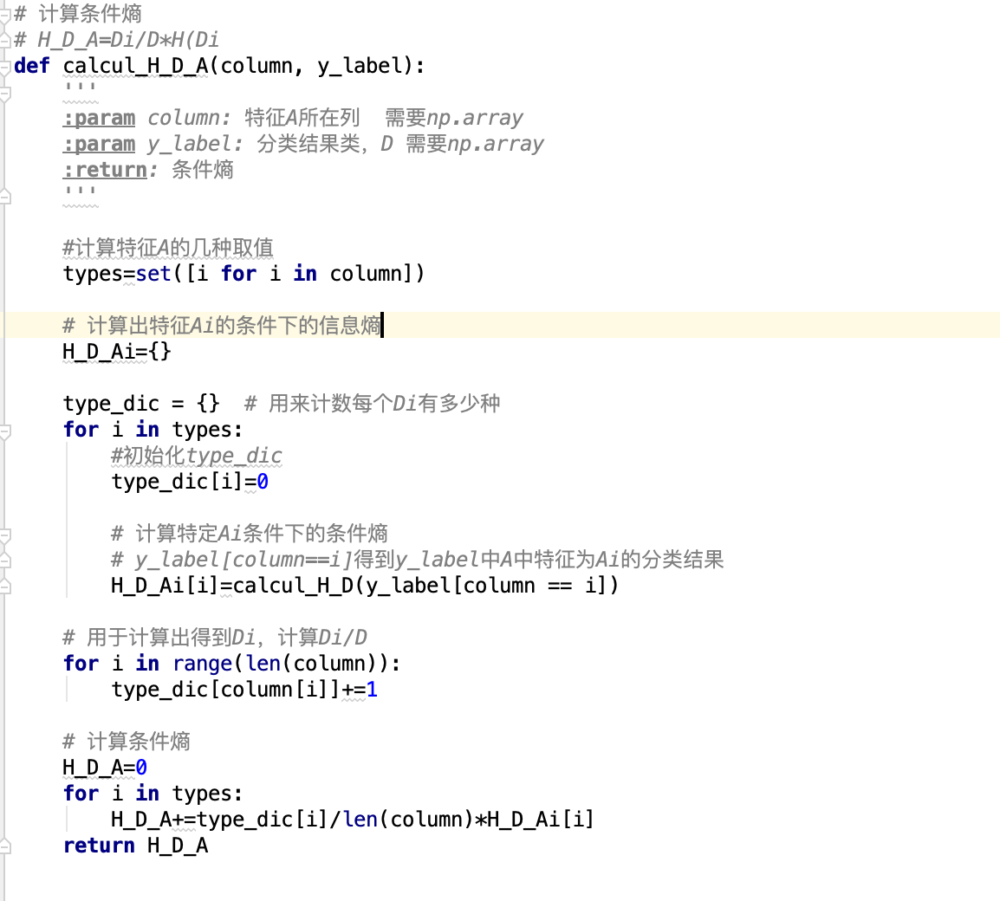
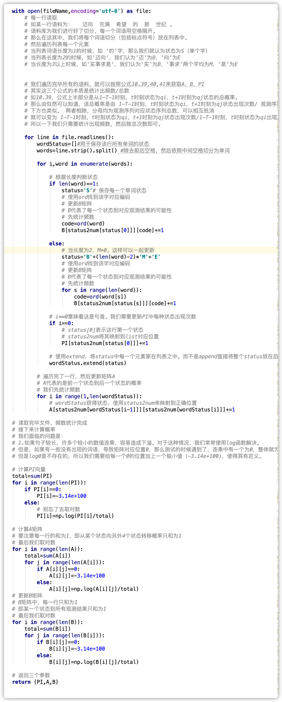

# 对于《统计学习方法》中部分算法模型的实现

Mnist数据集在Mnist文件夹中，是压缩包形式，需要解压。

算法都有详细的解读，对于书中对应公式也都有部分标注出来，易于阅读。如果可以帮助到你，也希望可以点个star啦～

像这样：

甚至是这样：

## 已完成

#### 分类模型：

##### 对Mnist二分类：

1. 感知机
2. 逻辑回归
3. SVM
4. Adaboost（提升树）

##### 对Mnist多分类：

1. KNN
2. 朴素贝叶斯
3. 决策树

#### 回归模型：

1. 梯度提升树（GBDT）（包含了回归树的实现）（波士顿房价数据集）[文章地址](https://zhuanlan.zhihu.com/p/113397045)

#### 中文分词：

1. 隐马尔可夫模型（中文分词，人民日报1998语料库）[文章地址](https://zhuanlan.zhihu.com/p/116011442)

#### 聚类：

1. 层次聚类（hierarchical_clustering）与K-means（对鸢尾花数据进行聚类）

#### 降维：

1. PCA（基于svd奇异值分解）

#### 参数估计:
1. GMM(EM算法应用)

